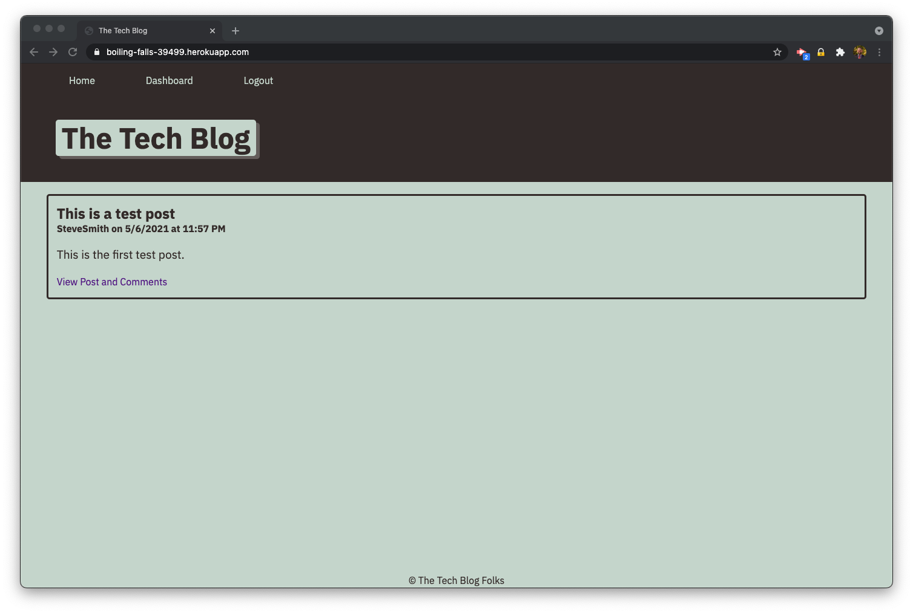
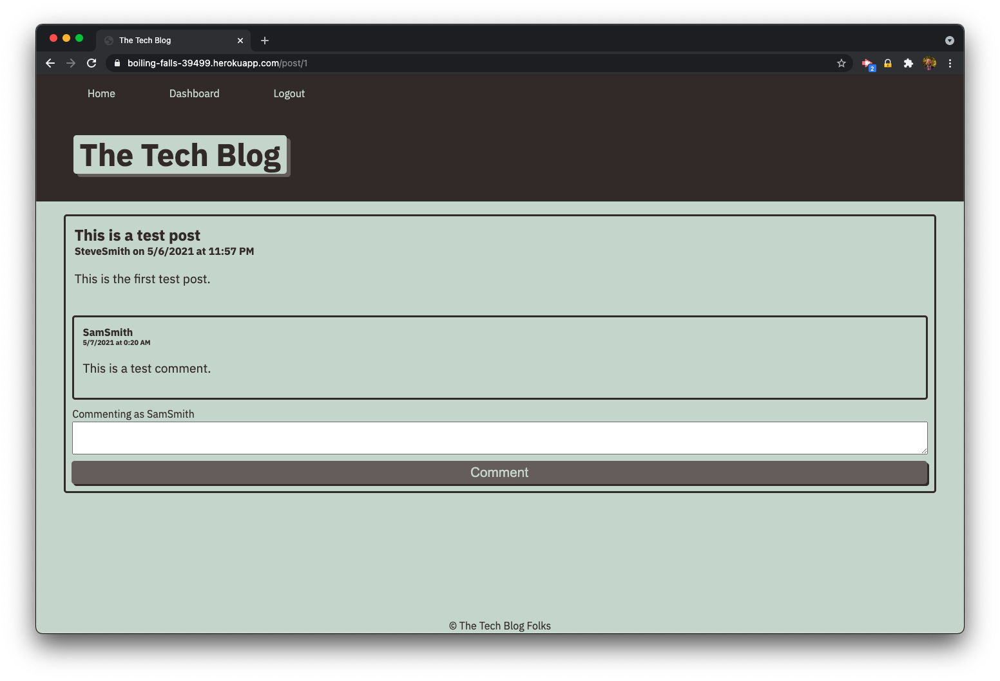
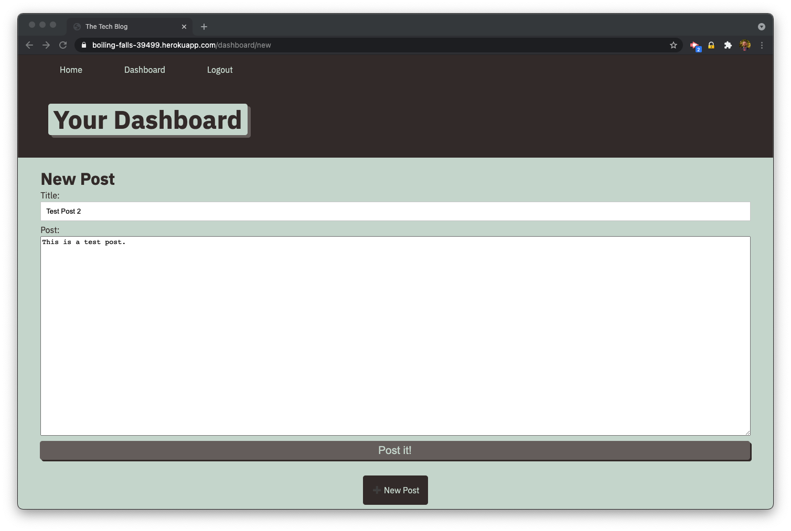

# Tech Blog

## Description

Tech Blog is a full stack application utilizing Node.js, Express, bCrypt, Handlebars, Sequelize and MySQL. Users can sign up, and once logged in have the ability to create blog posts and comment on other users' posts.

## Table of Contents

- [Installation](#installation)
- [Usage](#usage)
- [Contribute](#contribute)
- [Test](#test)
- [License](#license)
- [Questions](#questions)

## Installation

Clone the repo and install Node dependencies, set up a MySQL database, seed the database (if you want to), and then type npm start. The blog can be accessed by going to http://localhost:3001/ or the address of your hosting provider.

## Usage

You navigate to http://localhost:3001/ or the address of your hosting provider. Then create an account and start writing.

## Contribute

Any input is appreciated! Email me if you have any suggestions.

## Test

You test the app by installing it and checking to see that Node and MySQL start with no errors. Then start the server and navigate to the website to check its functionality.

## License

Copyright (c) Sam Gates. All rights reserved.
Licensed under the [MIT](https://opensource.org/licenses/MIT) license.

## Questions

Check out my [GitHub Profile](https://github.com/sg0703).

Email with questions! You can reach me at sam.j.gates@gmail.com.
